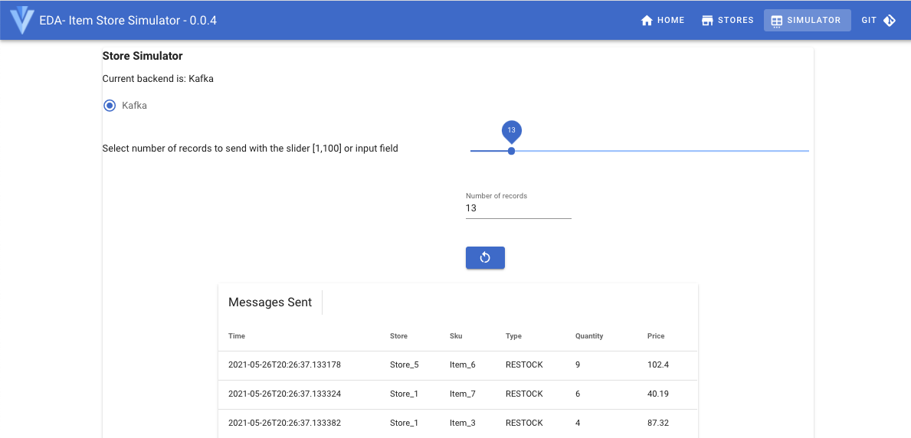
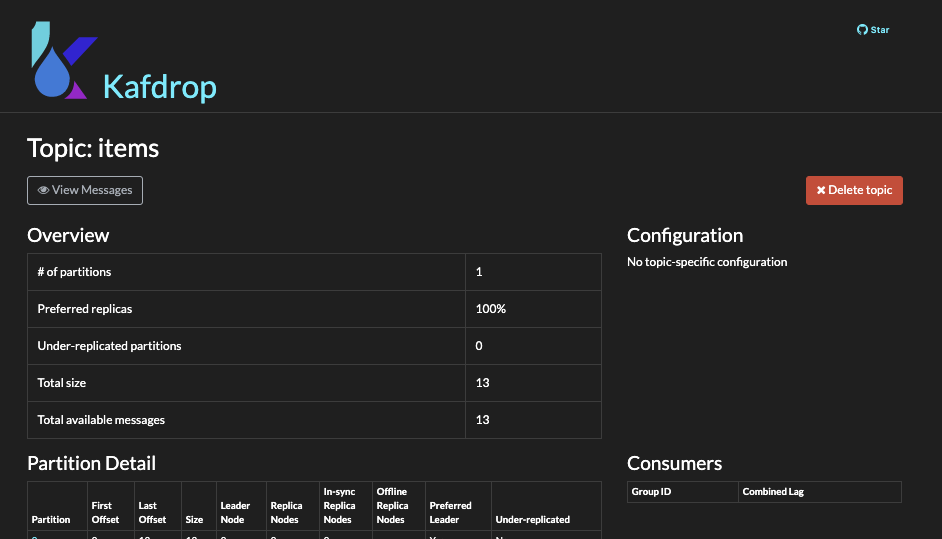
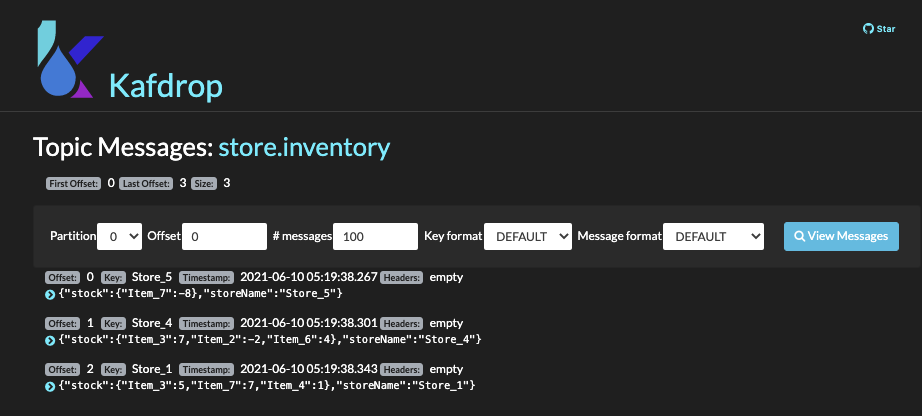

# Item sold store inventory aggregator component

The goal of this  Kafka streams implementation is to build a real time store inventory view from items sold in different stores. 
The aggregates are kept in state store and exposed via interactive queries.

The project is used as a Kafka Streams lab [documented here](https://ibm-cloud-architecture.github.io/refarch-eda/use-cases/kafka-streams/lab-3/) with instructions to deploy and run it on OpenShift.

Here is a simple diagram to illustrate the components used:

 

The goal of this note is to present how to run this store inventory aggregator locally using Strimzi Kafka image and instructions to build it.

Updated 06/09/2021

## Pre-requisites

For development purpose the following pre-requisites need to be installed on your working computer:

**Java**
- For the purposes of this lab we suggest Java 11+
- Quarkus (on version 1.13.x)

**Git client**

**Maven**
- Maven will be needed for bootstrapping our application from the command-line and running
our application.

**Docker**

If you want to access the end solution clone the following git repository: `git clone https://github.com/ibm-cloud-architecture/refarch-eda-store-inventory`.

## In a hurry, just run it locally

* Start local Kafka: `docker-compose  up -d` to start one Kafka broker, and two item-inventory service instances. 
* Created the `items` and `store.inventory` topics on your Kafka instance
 
 ```shell
 ./scripts/createTopics.sh 
######################
 create Topics
Created topic items.
Created topic store.inventory.

./scripts/listTopics.sh 
######################
 List Topics
store.inventory
items
 ```

* Verify each components runs well with `docker ps`:

```sh
CONTAINER ID   IMAGE                                      PORTS                     NAMES
f31e4364dec9   quay.io/ibmcase/eda-store-simulator        0.0.0.0:8082->8080/tcp    storesimulator
2c2959bbda15   obsidiandynamics/kafdrop                   0.0.0.0:9000->9000/tcp    kafdrop
3e569f205f6f   quay.io/strimzi/kafka:latest-kafka-2.7.0   0.0.0.0:29092->9092/tcp   kafka
0cf09684b675   quay.io/strimzi/kafka:latest-kafka-2.7.0   0.0.0.0:2181->2181/tcp    zookeeper
```

* Start the app in dev mode: `./mvnw quarkus:dev`

Then [see the demonstration](#demonstration-script) script section below to test the application.

## Demonstration script

Once started go to one of the Store Aggregator API: [swagger-ui/](http://localhost:8080/q/swagger-ui/) and select
the `​/api​/v1​/stores​/inventory​/{storeID}` end point. Using the `Store_1` as storeID you should get an empty response.

* Send some item sale simulated records with `curl` on the simulator APIs: `curl -X POST http://localhost:8082/start -d '20'` or using the user interface at [http://localhost:8082/](http://localhost:8082/)

  

* Use [Kafdrop UI](http://localhost:9000/) to see messages in `items` topic.

  

* Verify the store inventory is updated: `curl -X GET "http://localhost:8080/api/v1/stores/inventory/Store_2" -H  "accept: application/json"`
* Verify messages are sent to `store.inventory` topic by 

  

**Remark: after the store aggregator consumes some items, you should see some new topics created, used to persist the 
the stores aggregates.**


## Tekton pipeline

Ensure the OCP cluster has a pipeline operator, and pipeline for building quarkus app is defined.

```sh
# Verify pipeline 
oc get pipelines -n rt-inventory-pipe
# Define resources
oc apply -f build/resources.yaml
oc create -f build/pipelinerun.yaml
```